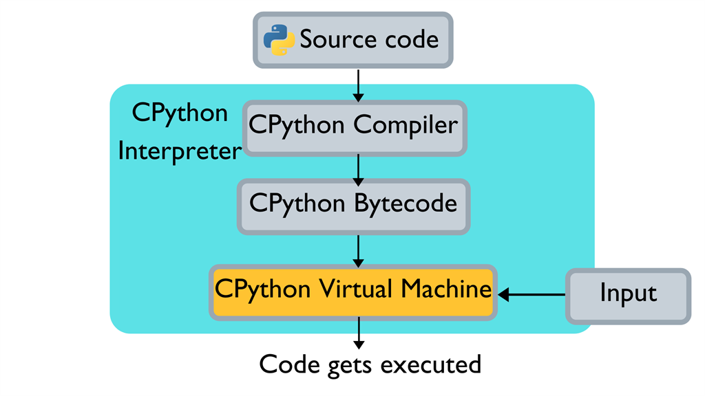
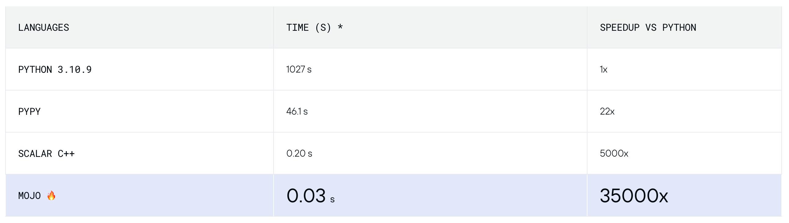
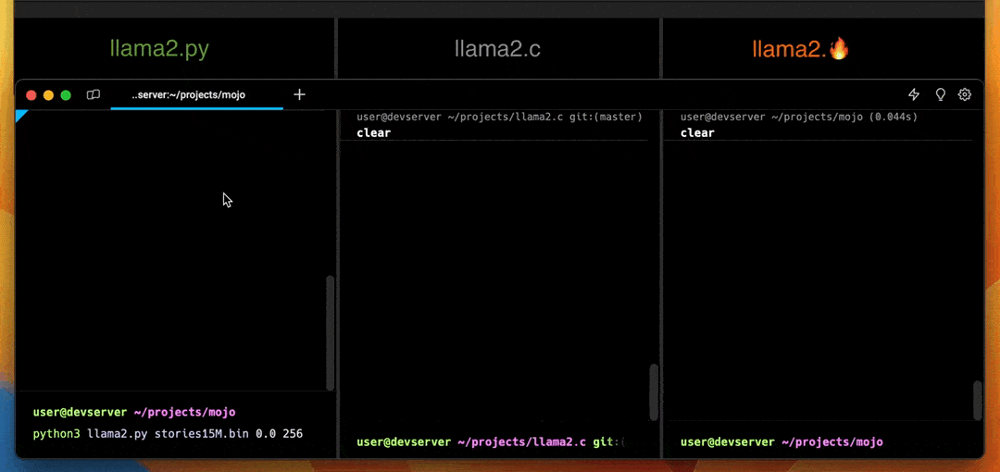

## 소개


Mojo는 파이썬의 단점을 보완하기 위해서 나온 언어이다.

### 등장 배경

#### Python이 느린 이유

파이썬은 사용자 친화적인 특성을 가져서 다양한 분야에서 사용되고 일반인도 쉽게 접할 수 있는 언어이다.

파이썬은 공식적으로 C로 구현되어 있는 구현체이다. 파이썬의 코드를 C가 컴파일해주는 역할을 한다. 이러한 방식을 Source-to-source compiler 방식이라고 한다.



<details>
<summary style="font-weight: bold">소스코드를 바이트코드로 변환한 모습</summary>
<div markdown="1">


Cpython 컴파일러에 의해서 바이트코드로 번역된다.

</div>
</details>

파이썬 코드를 Cpython 컴파일러가 바이트코드로 번역해주고 이것을 가상머신에서 인터프리터 방식으로 한 줄 씩 해석한다. 이러한 컴파일러와 인터프리터 방식을 동시에 사용하는 언어를 하이브리드 언어라고 한다.

첫 번쨰 이유는 파이썬이 Cpython으로 인해서 속도가 느려지는 문제 생긴다.

두 번째 이유는 Cpython이 GIL이라는 Global Interpreter Lock으로 인해서 하나의 스레드가 하나의 바이트코드만을 실행할 수 있도록하는 기능으로 메모리 메모리 안정성을 확보할 수 있다. 하지만 단점으로는 멀티스레딩을 지원하지 않기 때문에 속도 저하가 발생한다.

마지막으로 동적 타입이여서 런타임 중에 타입을 추정하기 때문에 실행 속도가 느리다.

이러한 파이썬의 사용자 친화적인 특징에 빠른 속도를 더한 것이 **‘Mojo’**다.

### Mojo🔥란?


Swift라는 ios와 Mac 앱 개발용 언어를 개발한 크리스 래트너가 세운 Modular에서 2023년에 개발한 언어이다.

### 파이썬과의 관계

Mojo는 파이썬의 모든 문법을 그대로 사용하는 것을 목표로 개발되고 있다. 그래서 현재 버전에서 기본적인 파이썬의 문법을 그대로 사용할 수 있다.

그리고 Mojo의 패키지인 Python을 통해서 파이썬의 패키지를 불러와서 사용할 수 있다.

```python
from python import Python

# This is equivalent to Python's `import numpy as np`
let np = Python.import_module("numpy")
a = np.array([1, 2, 3])
```

그래서 파이썬에 익숙한 사용자는 쉽게 Mojo에 접근할 수 있다.

## Mojo의 특징

### 빠른 속도


Mojo는 병렬처리가 가능하도록 만들어져서 동시에 여러 작업을 처리할 수 있어서 파이썬의 속도를 능가한다.



파이썬과 파이썬의 느린 속도를 개선하기 위한 구현체인 pypy와 mojo를 비교한 성능에서 파이썬의 성능을 1로 했을 때 성능에 3500배 빠르다는 결과를 보여줬다. 파이썬을 최적화를 하더라도 Mojo의 성능을 따라 잡지는 못할 것이다.



이러한 빠른 속도는 인공지능에서도 확인할 수 있다. 위에서는 llama2라는 Meta의 언어모델을 파이썬과 c언어, mojo로 각각 구현해서 실행했을 때이다. 파이썬이 둘에 비해서 현저히 속도가 낮은 것을 볼 수 있다.

### 인공지능 특화 언어


Mojo는 파이썬의 성능을 개선한 것 뿐만 아니라 AI에 특화된 언이이다. Mojo에서는 AI 인프라를 단순화하여 개발, 배포를 할 수 있도록 하는 확장 가능한 플랫폼이라고 소개하고 있습니다.

- **모든 것을 하나의 언어로 작성가능하다.**

  파이썬의 유용성과 C, C++ 또는 CUDA을 통해 가능했던 시스템 프로그래밍을 결합한 언어의 형태를 가진다.

- **파이썬 성능 잠금 해제**

  Mojo를 통해서 C, C++, CUDA를 사용해야 했던 시스템 프로그래밍을 가능해서 GPU나 ASIC과 같은 가속기를 작업을 할 때 비슷한 성능을 제공한다.

- **파이썬의 생태계와의 완벽한 호환**

  Mojo의 기능과 성능 이점을 활용하면서 Python 라이브러를 원할하게 사용할 수 있다. 예를 들어 NumPy와 Matplotlib를 Mojo 코드와 원활하게 혼합할 수 있습니다.


이 외에도 매개변수에 대한 최적의 값을 자동으로 찾아주는 기능도 포함하고 있다.

## 🔭Mojo의 전망

### 오픈소스

오픈소스의 장점이라면 누구나 사용할 수 있고 누구나 수정을 할 수 있어서 소프트웨어가 다수에 의해서 발전할 수 있다는 것이다. Mojo는 현재 사유 소프트웨어로 소스 코드가 공개되어 있지는 않지만, 사용은 할 수 있다. 희소식이라면 Mojo를 개발한 Modular에서는 완벽하게 개발된 이후에 오픈소스화를 계획하고 있다.

[Modular Docs - Mojo🔥 FAQ](https://docs.modular.com/mojo/faq.html#will-mojo-be-open-sourced)

### 파이썬 대체?


Mojo가 파이썬을 미래에는 대체할 것이다. 하지만 그 형태는 완전한 대체보다는 상위호환의 형태가 될 것으로 보인다. 아래에서는 이전의 상위호환하는 언어의 관계를 예로 설명하고 있다.

- **C와 C++ 관계**

  C++가 C에서 필요한만큼의 기능을 추가한 언어인것처럼 Modular에서는 Mojo를 파이썬의 문법과 달라지는 것이 아니라 파이썬을 보완하는 언어를 만드는 것을 생각하고 개발했다고 했다. 그래서 Python++으로 불린다. 그래서 파이썬을 대체하기 보다는 파이썬의 발전과 함께 발전하는 것으로 생각된다.

  [Mojo🔥 roadmap & sharp edges](https://docs.modular.com/mojo/roadmap.html#overall-priorities)

- **Objective-c와 Swift 관계**

  크리스 래트너는 이전에 Swift를 통해서 Objective-C를 완전히 대체했다. 그래서 많은 사람들이 단점이 많았던 Objective-C가 사라질 것이라고 생각했다. 하지만 현재까지도 Objective-C는 예전의 라이브러리를 사용하기 위해서 사용되고 있다. 그래서 Mojo를 사용하더라도 파이썬의 라이브러리를 사용하기 위해서 파이썬이 사용될 것이다.
